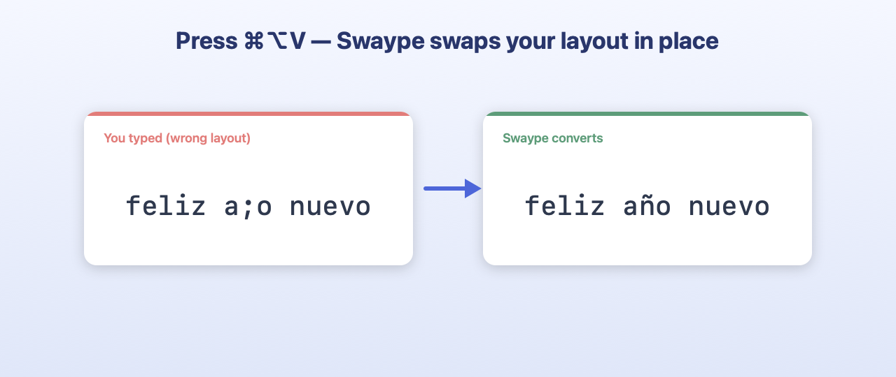
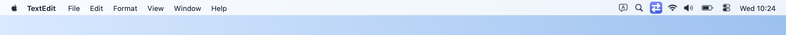
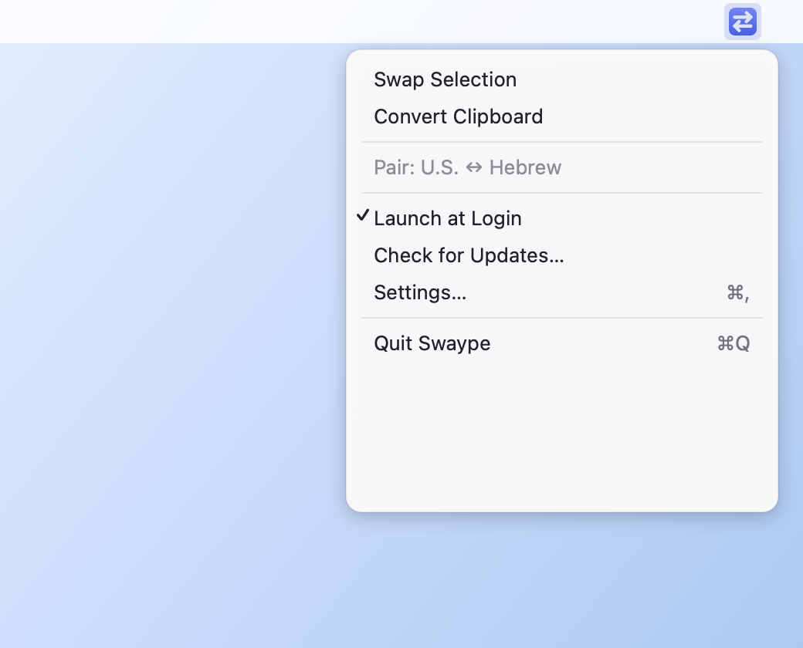
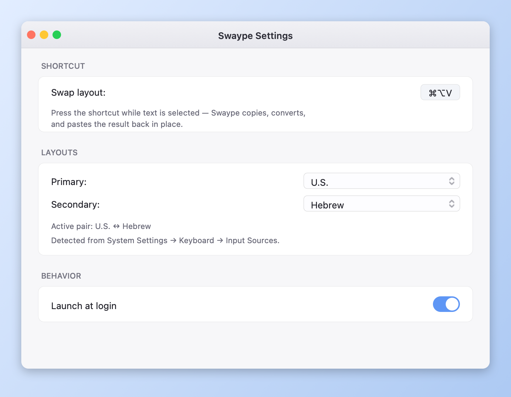

# Swaype

<p align="center">
  
</p>

<p align="center">
  <em>Type on the wrong keyboard layout? Press one shortcut and Swaype fixes it in place.</em>
</p>

<p align="center">
  
  
  
  <a href="../../actions/workflows/build.yml"></a>
  <a href="../../releases/latest"></a>
</p>

<p align="center">
  <strong><a href="../../releases/latest/download/Swaype.dmg">↓ Download latest DMG</a></strong>
</p>

---

## What it does

You're typing in English. You meant to type Hebrew. You end up with `akuo guko`
instead of `שלום עולם`. Select the text, hit **⌘⌥V**, and Swaype:

1. Copies the selection
2. Re-interprets each character as if you'd been on the correct layout
3. Pastes the corrected text back in place

Works for **any pair of keyboard layouts** you have installed in *System Settings
→ Keyboard → Input Sources* — Swaype reads your installed keyboards via the
macOS Text Input Sources API and builds the mapping automatically. Hebrew is
the bundled fallback example; Russian, Arabic, Greek, etc. all work too.



## Screenshots

> **Heads up:** the menu bar / settings screenshots are placeholders until
> someone captures them on a real Mac. See [`screenshots/README.md`](screenshots/README.md).

### Menu bar


### Dropdown menu


### Settings


## Features

- **One shortcut, in-place swap** — default ⌘⌥V; rebindable in Settings.
- **Auto-detects your installed keyboards** — picks a sensible Latin / non-Latin
  default pair on first launch, both overridable from Settings.
- **Works with any pair of layouts** — US ↔ Hebrew, UK ↔ Russian, ABC ↔ Arabic,
  whatever you have installed. The mapping is built from macOS itself, not a
  hardcoded table.
- **Convert clipboard** option for when you want the converted text *without*
  pasting (handy if the focused app is sensitive about ⌘V).
- **Live "active pair" indicator** in the menu bar dropdown.
- **No network access.** Ever. See [SECURITY.md](SECURITY.md).
- **Tiny binary** (~1 MB) and a single Swift package dependency
  (`KeyboardShortcuts`).

## Installation

### Download

1. Grab the latest `Swaype.dmg` from [Releases](../../releases/latest).
2. Open it. Drag **Swaype** to **Applications**.
3. Launch Swaype from `/Applications`. The colourful arrow icon appears in
   your menu bar.

> **First-launch Gatekeeper warning** — the DMG is ad-hoc signed (no paid Apple
> Developer ID; see [SECURITY.md](SECURITY.md#distribution-and-code-signing)).
> macOS may refuse to launch the app, or it may silently quit. Run this once:
> ```bash
> xattr -dr com.apple.quarantine /Applications/Swaype.app
> open /Applications/Swaype.app
> ```
> If it *still* doesn't open, run from Terminal to see what's going wrong:
> ```bash
> /Applications/Swaype.app/Contents/MacOS/Swaype
> ```
> The app logs its version, bundle path, and detected keyboards at launch.
> Crashes also surface in Console.app under "Swaype".

### Build from source

```bash
git clone https://github.com/<owner>/Swaype.git
cd Swaype
swift test           # 14 unit tests on the converter
./Scripts/build.sh   # produces build/Swaype.app and build/Swaype.dmg
```

**Requirements**
- macOS 13 Ventura or later
- Xcode 15+ (full Xcode — Command Line Tools alone can't link XCTest)

If `swift test` fails with `no such module 'XCTest'`:
`sudo xcode-select -s /Applications/Xcode.app/Contents/Developer`.

## Usage

1. Launch Swaype. The arrow icon appears in your menu bar.
2. (Optional) Open **Settings…** from the menu and confirm the Primary /
   Secondary layouts match your real keyboards.
3. In any app, select text that came out on the wrong layout.
4. Press **⌘⌥V**. The selection is replaced with the correctly-converted text.
   Your original clipboard is restored afterwards.

The first time you trigger the shortcut, macOS will ask for **Accessibility**
permission (so Swaype can synthesize ⌘C and ⌘V into the focused app). Grant it
in *System Settings → Privacy & Security → Accessibility* and try again.

If you'd rather not grant Accessibility, use **Convert Clipboard** from the
menu — it works clipboard-only, no synthesized keystrokes, just copy → click
menu item → paste manually.

## Settings

Open from the menu bar dropdown → **Settings…**.

- **Swap shortcut** — record any global shortcut you like
- **Primary layout** — your Latin (US, UK, ABC, …) keyboard
- **Secondary layout** — your other keyboard (Hebrew, Russian, Arabic, …)
- **Launch at login** — adds Swaype as a Launch Item via `SMAppService`

The picker is populated from your actual installed input sources. Add or
remove keyboards in *System Settings → Keyboard → Input Sources* and they'll
appear in Swaype next time you open the Settings window.

## Adding a bundled layout pair

You typically don't need to do this — Swaype reads your installed keyboards.
But if you want to ship a fallback (used when only one keyboard is installed),
add a static `LayoutPair` in [`Sources/SwaypeCore/Mappings/`](Sources/SwaypeCore/Mappings/):

```swift
extension LayoutPair {
    public static let englishRussian = LayoutPair(
        id: "en-ru",
        name: "English ↔ Russian",
        positions: [
            .init(en: "q", "й"),
            .init(en: "w", "ц"),
            // …
        ]
    )
}
```

Only positions where the two layouts *differ* need to be listed. Digits, space,
unmapped punctuation, and emoji pass through automatically.

## Project layout

```
Sources/
├── SwaypeCore/    # pure conversion engine (tested in isolation)
└── Swaype/        # menu-bar app: status item, hotkey, settings
Scripts/
├── build.sh                 # full pipeline → Swaype.app + Swaype.dmg
├── MakeIcon.swift           # app icon
├── MakeMenuBarIcon.swift    # colourful menu bar icon
├── MakeDMGBackground.swift  # installer DMG background
└── MakeHeroAssets.swift     # README artwork
.github/workflows/build.yml  # CI: build, tag, release
```

More on the layout and conventions in [CONTRIBUTING.md](CONTRIBUTING.md).

## Privacy

Swaype never connects to the network. No telemetry, no update check, no
remote call of any kind. The clipboard text it processes is held in memory
only and is never written to disk. See [SECURITY.md](SECURITY.md) for the
full threat model.

## Contributing

Bug reports, layout-pair fixes, and feature ideas welcome. See
[CONTRIBUTING.md](CONTRIBUTING.md) for setup, conventions, and the PR
checklist. Security issues → [SECURITY.md](SECURITY.md).

## License

MIT. See [LICENSE](LICENSE).

## Acknowledgements

- [`KeyboardShortcuts`](https://github.com/sindresorhus/KeyboardShortcuts) by
  Sindre Sorhus — the global hotkey library that powers the swap shortcut.
- Apple's Text Input Sources API — Carbon may be ancient but it still does the
  most accurate job of reading every installed keyboard layout.
